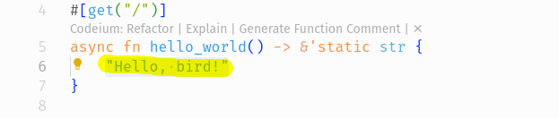

# DenisWritesCode's Solutions to Shuttle's Christmas Code Hunt 2024

[Link to the challenges](https://console.shuttle.dev/shuttlings/cch24)

I will be using this repo to provide a walkthrough for anyone interested in learning how to solve such challenges.
I will share my thoughts and also take-aways, and whenever I have enough time on my hands, I will also go into more detail about each solution, try to optimize solutions and maybe, just maybe provide more material to help expound the concepts further.

With that said, let's get to it. I assume you have `cargo` and `shuttle` initiliazed. If not, head over here and follow the instructions under *Getting started*. It's also a good idea to install `cch24-validator` for validating our solutions after we code them up.

## Challenge -1

### Task 1: Hello, bird!

- This challenge is really simple, find the line in *src/main.rs* that reads `Hello World!` and edit it to read `Hello, bird!`. There, done!
- 
