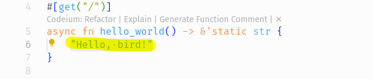
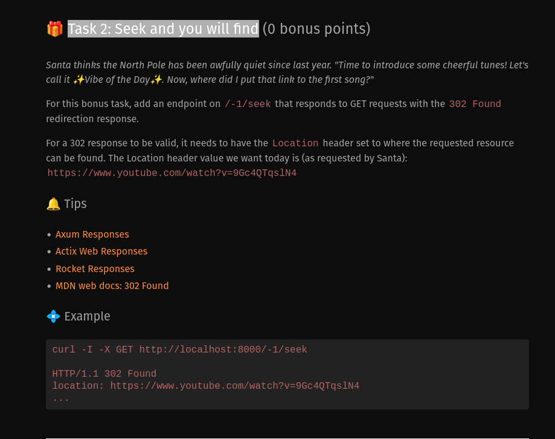
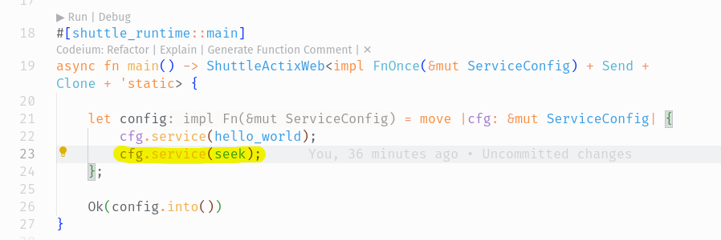
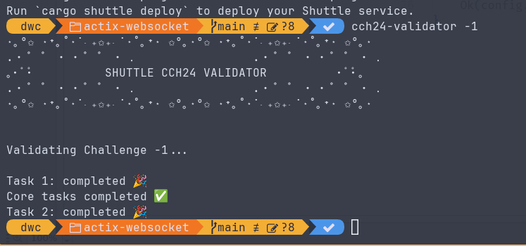
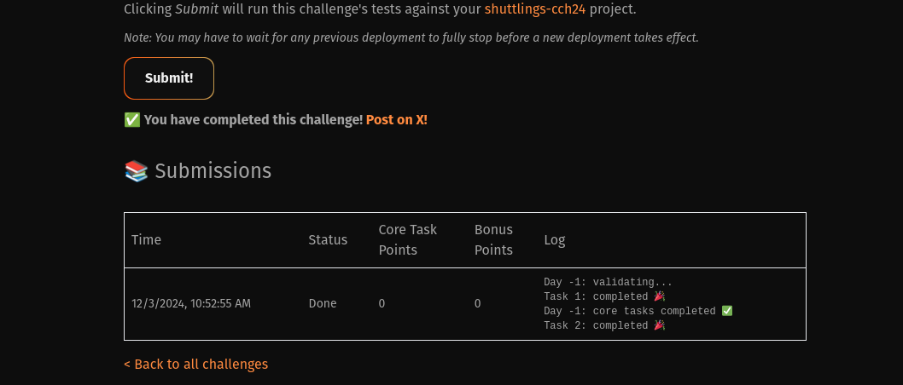
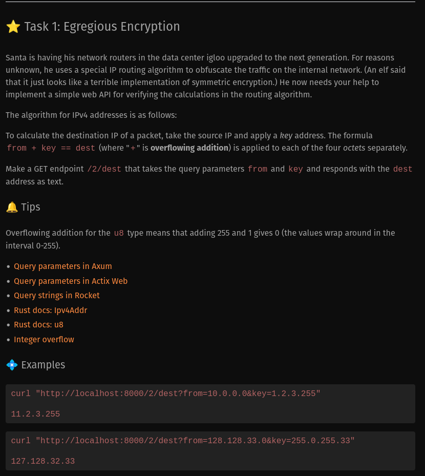
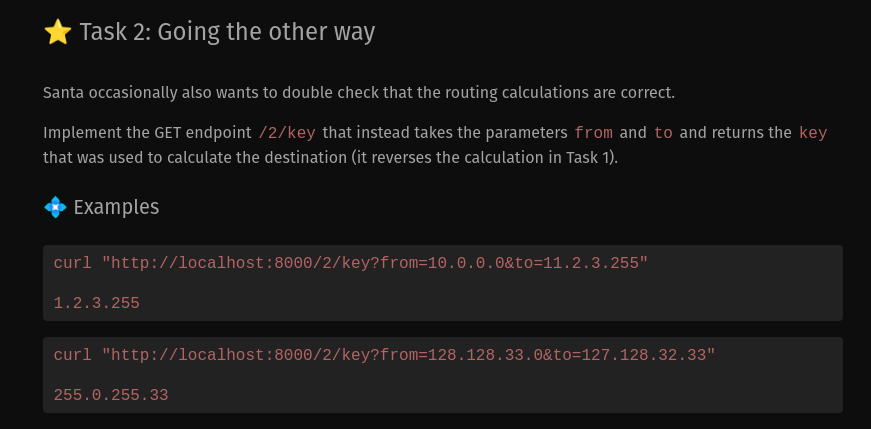
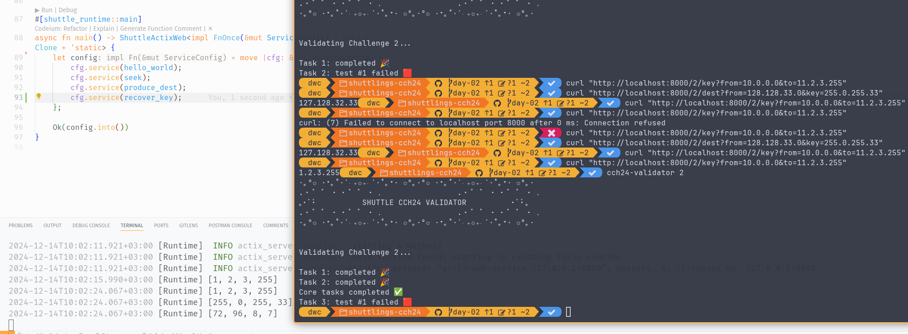
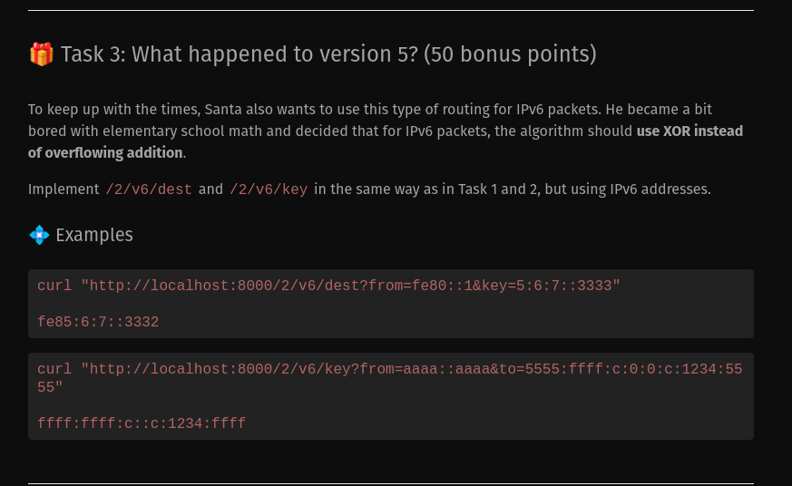
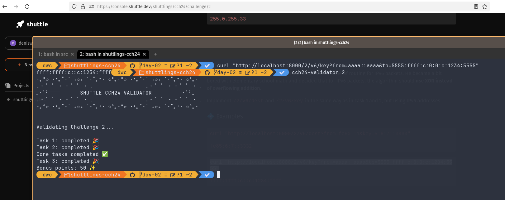

# DenisWritesCode's Solutions to Shuttle's Christmas Code Hunt 2024

[Link to the challenges](https://console.shuttle.dev/shuttlings/cch24)

I will be using this repo to provide a walkthrough for anyone interested in learning how to solve such challenges.
I will share my thoughts and also take-aways, and whenever I have enough time on my hands, I will also go into more detail about each solution, try to optimize solutions and maybe, just maybe provide more material to help expound the concepts further.

With that said, let's get to it. I assume you have `cargo` and `shuttle` initiliazed. If not, head over [here](https://console.shuttle.dev/shuttlings/cch24/challenge/-1) and follow the instructions under *Getting started*. It's also a good idea to install `cch24-validator` for validating our solutions after we code them up.

## Day -1

### Task 1: Hello, bird

- This challenge is really simple, find the line in *src/main.rs* that reads `Hello World!` and edit it to read `Hello, bird!`. There, done!
- 

### Task 2: Seek and you will find



- This challenge ask for adding another endpoint at `/-1/seek` and using it to redirect to [this youtube video](https://www.youtube.com/watch?v=9Gc4QTqslN4).
- I chose to use Actix web framework, since it is what I am most comfortable with.
- It reads much like `express.js` so if you have some TypeScript experience this should be right up your alley.
- Add a new endpoint:

    ```rust
      #[get("/-1/seek")]
      async fn seek() -> impl Responder {
          // Redirect using "302 Found" HTTP Status Code
          HttpResponse::Found().append_header((LOCATION, "https://www.youtube.com/watch?v=9Gc4QTqslN4")).finish()
      }
    ```

- Register it like so - line 23:

    
- Validate with `cch24-validator` as shown in the screenshot and would you know it, there, done!
    
- Once you publish your solution to [shuttle.dev](https://www.shuttle.dev/) with `shuttle deploy --name shuttlings-cch24` you can then hit submit on your console and collect your 0 points - for now.
    

## Day 2

### Task 1: Egregious Encryption



- For this task, you have to be familiar with integer overflowing - which is wrapping the overflowed bits if the result of the addition is greater than the maximum allowed range. For example, if we have a regular `u8` field, `255+1 = 0` because `u8` fields only house numbers from 0-255. The extra added 1, overflowed to 256 and thus was made the next number in the sequence -> 0.
- With actix-web, we use query params and not url params by extracting them from the query itself using `web::Query<QueryParams>`.

#### Use Rust's Ipv4 and Ipv6 crates

- Then convert the query params to Ipv4Addresses from the rust crate `std::net`.
- Once we have a valid Ipv4Addr type, we can then call the `.octets()` method on it and have it extract the 4 octets of an Ipv4.
- We then loop over the octets contained in the `from_octets` vector, and perform *wrapping additions* using [wrapping_add()](https://doc.rust-lang.org/std/primitive.u8.html#method.wrapping_add) and add the corresponding `to[from_*index*]` value to a result vector.
- We then recreate an IpV4 address from the resultant vector and then return it as our response.

#### DEPRECATED: This was done in the shortest way possible. My preferred approach is the one above.

- After that, we have to split the strings on the delimit character `.` and convert that to an unsigned int `u8`. Then we collect them into a `Vec`.
- We then loop over the `from` vec and perform *wrapping addition* using [wrapping_add()](https://doc.rust-lang.org/std/primitive.u8.html#method.wrapping_add) and add the corresponding `to[from_*index*]` value to a result vector.
- With the resultant vec of our wrapping addition, we then convert it back to a vector of strings and then join all the elements of that vector into a string again with a `.` character as our delimiter and respond with that result.
- With that, we can be run `cch24-validator 2` to see that we successfully pass *Task 1*.


### Task 2: Going the other way



- This task wants a reverse of Task-1 above. All it requires is extraction of the query params from the query as above.
- Then we convert both to IpV4 addresses, before obtaining their octets.
- We then use the opposite of *wrapping_add()*, which is [wrapping_sub()](https://doc.rust-lang.org/std/primitive.u8.html#method.wrapping_sub) to calculate the key used to do the addition in the first place.
- Then join the resultant vector of our calculation and return it.



-

### Task 3: What happened to version 5?



- This challenge requires knowledge of *[XOR bit manipulation](https://doc.rust-lang.org/std/ops/trait.BitXor.html)* and the difference between Ipv4 and [Ipv6 addresses](https://doc.rust-lang.org/std/net/struct.Ipv6Addr.html). In a sentence, an XOR operation takes two bits ( a bit can either be *0* or *1*) and then it excludes the cases where the bits have a similar value.
- *i.e*

    ```assembly
        0 XOR 0 = 0
        0 XOR 1 = 1
        1 XOR 0 = 1
        1 XOR 1 = 0
    ```

- Considering the only change is the type of IP Address, then it becomes easier to solve for these two, since all we have to do is repeat the steps from Tasks 1 & 2 above - but keeping in mind that we are working with [XOR](https://doc.rust-lang.org/std/ops/trait.BitXor.html) -> denoted by the `^` symbol in rust, and also that we are using Ipv6 addresses.

- There, all of Day 2 Tasks done!
