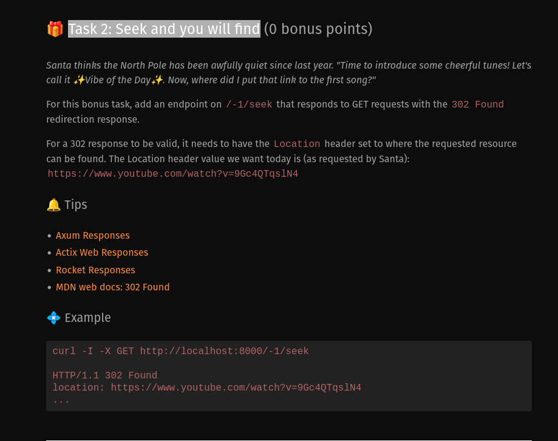
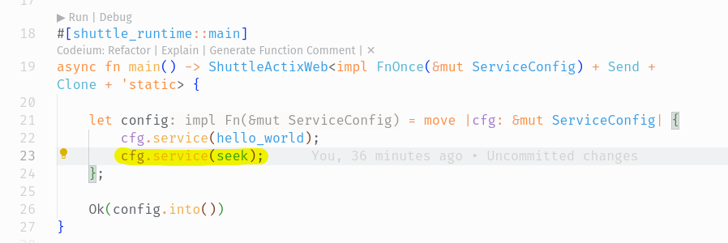
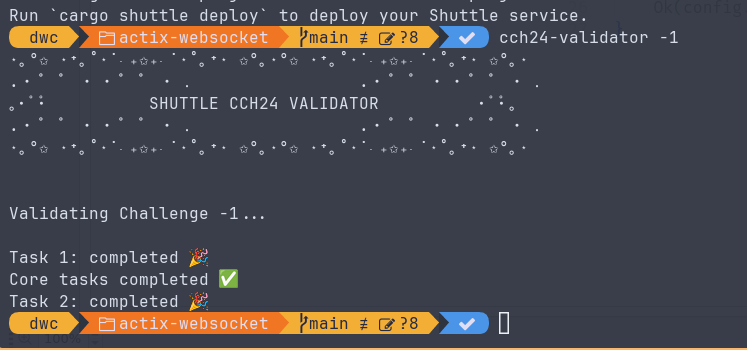

# DenisWritesCode's Solutions to Shuttle's Christmas Code Hunt 2024

[Link to the challenges](https://console.shuttle.dev/shuttlings/cch24)

I will be using this repo to provide a walkthrough for anyone interested in learning how to solve such challenges.
I will share my thoughts and also take-aways, and whenever I have enough time on my hands, I will also go into more detail about each solution, try to optimize solutions and maybe, just maybe provide more material to help expound the concepts further.

With that said, let's get to it. I assume you have `cargo` and `shuttle` initiliazed. If not, head over [here](https://console.shuttle.dev/shuttlings/cch24/challenge/-1) and follow the instructions under *Getting started*. It's also a good idea to install `cch24-validator` for validating our solutions after we code them up.

## Challenge -1

### Task 1: Hello, bird!

- This challenge is really simple, find the line in *src/main.rs* that reads `Hello World!` and edit it to read `Hello, bird!`. There, done!
- 

### Task 2: Seek and you will find



- This challenge ask for adding another endpoint at `/-1/seek` and using it to redirect to [this youtube video](https://www.youtube.com/watch?v=9Gc4QTqslN4).
- I chose to use Actix web framework, since it is what I am most comfortable with.
- It reads much like `express.js` so if you have some TypeScript experience this should be right up your alley.
- Add a new endpoint:

    ```rust
      #[get("/-1/seek")]
      async fn seek() -> impl Responder {
          // Redirect using "302 Found" HTTP Status Code
          HttpResponse::Found().append_header((LOCATION, "https://www.youtube.com/watch?v=9Gc4QTqslN4")).finish()
      }
    ```

- Register it like so - line 23:

    
- Validate with `cch24-validator` as shown in the screenshot and would you know it, there, done!
    
- Once you publish your solution to [shuttle.dev](https://www.shuttle.dev/) with `shuttle deploy --name shuttlings-cch24` you can then hit submit on your console and collect your 0 points - for now.
    
